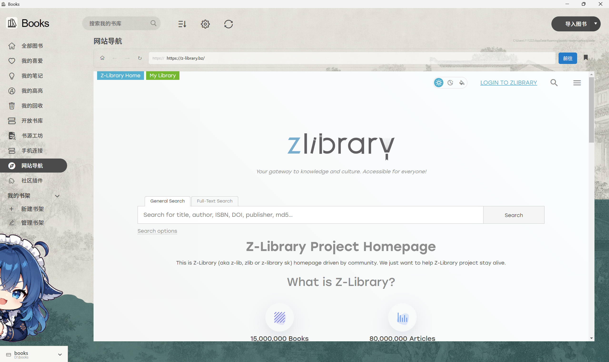
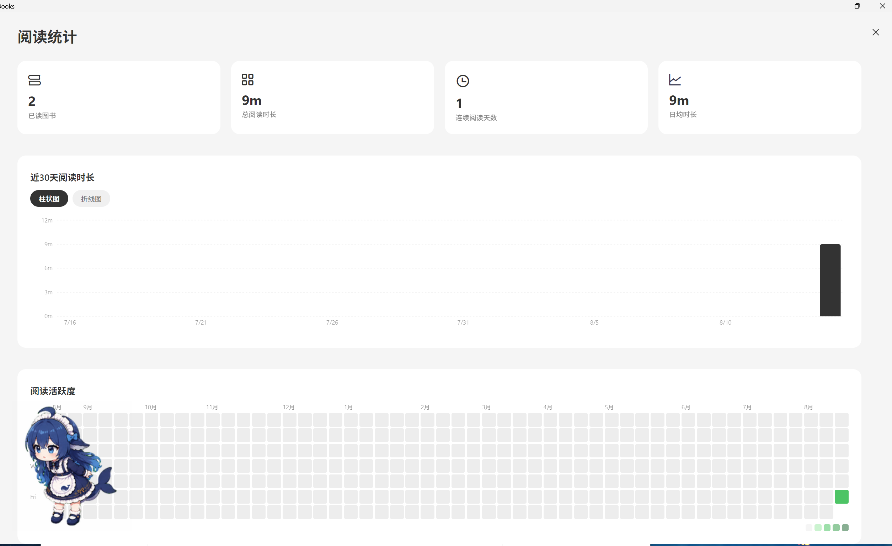

# Books

> A calm, local-first desktop ebook reader for Windows, macOS, and Linux.

**English | [简体中文](README.zh-CN.md)**

Books is an open-source desktop ebook reader built with Electron, React, and Redux. It keeps the familiar reading experience of Koodo Reader while extending local library management, shelves, reading statistics, reader customization, and online-library features.

Books is designed for readers who want their books, reading progress, and reading environment to stay organized locally. You can choose where your library lives and use the library panel in the lower-left corner to browse and manage folders directly.

## Features

- Supports EPUB, PDF, MOBI, AZW, AZW3, TXT, FB2, CBR, CBZ, CBT, CB7, Markdown, DOCX, HTML, XML, XHTML, and MHTML.
- Local libraries and custom shelves with shelf creation, drag-and-drop organization, and optional shelf counts.
- Built-in ZLibrary access from inside the application. Availability depends on network conditions and local laws.
- Reading statistics for reading time, progress, book counts, and other reading data.
- Reader themes, background images, fonts, font sizes, line spacing, page layouts, and night mode.
- Custom symbol-color rules for highlighting specific content while reading.
- Notes, highlights, bookmarks, reading progress, and reading history.
- Snapshots, data restore, book export, note export, and highlight export.
- Cloud synchronization and configurable online libraries and book sources.
- A local folder-library panel for creating folders, creating Markdown notes, refreshing entries, and opening the current folder.
- A portable Windows desktop build that can run without installation.

## Screenshots

### ZLibrary

An integrated ZLibrary entry makes it easier to move between the reader and online book resources.



### Statistics

Review reading habits and progress from the statistics page.



### Shelves

Organize books by topic, status, source, or any structure that fits your workflow.


### Reading interface

Read in a focused interface with controls for themes, typography, backgrounds, and layout.


## Download for Windows

Download the latest build from [GitHub Releases](https://github.com/user-A100/books-reader/releases).

1. Download `Books-x.x.x-win-x64-portable.zip`.
2. Extract it to any folder.
3. Launch `Books.exe`.

The portable build does not require installation. Your library and application data remain in the locations configured in Books and are not included in the release archive.

## Development and build

Requirements:

- Node.js 20 or newer
- npm or Yarn
- Python
- Visual Studio C++ Build Tools
- LLVM (Clang-cl) for Electron native dependencies

Install dependencies:

```powershell
npm install --legacy-peer-deps
```

Start development:

```powershell
yarn dev
```

Build the React frontend:

```powershell
npm run build
```

Rebuild native modules:

```powershell
npm run rebuild
```

Build the desktop application:

```powershell
npm run release
```

Build output is written to `dist/`. To create only a Windows portable build:

```powershell
npx electron-builder --win portable
```

## Data and privacy

- Books stores application data in the local user-data directory by default.
- The library location can be configured in the application and managed from the lower-left library panel.
- Cloud synchronization, online sources, and third-party services are used only after the user configures them.
- Do not commit tokens, passwords, private book paths, or private configuration files to a public repository.

## License and attribution

Books is a rebuilt and independently maintained open-source project based on [Koodo Reader](https://github.com/koodo-reader/koodo-reader). It retains the upstream Apache License 2.0 notices and attribution. See [LICENSE](LICENSE) and [NOTICE.md](NOTICE.md) for details. The Books name, logo, local-library features, and subsequent changes are maintained independently.
